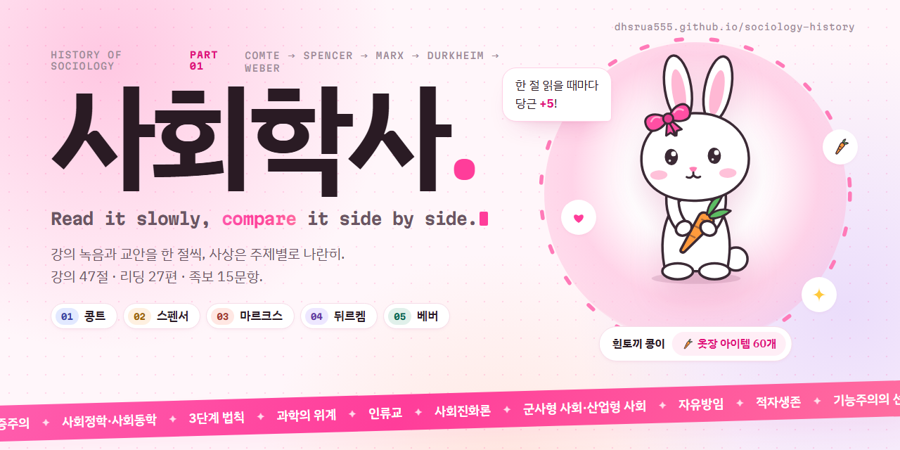

# 사회학사 1차

콩트 · 스펜서 · 마르크스 · 뒤르켐 · 베버 범위의 사회학사 시험 대비 스터디 사이트. 강의 녹음과 교안을 한 절씩 읽고, 사상가들의 생각을 주제별로 나란히 비교합니다.

**사이트:** https://dhsrua555.github.io/sociology-history/

`index.html`을 브라우저로 열면 바로 동작합니다(로컬 서버 불필요). 글꼴은 Google Fonts를 씁니다.

## 구성

| 화면 | 내용 |
|---|---|
| 사상가별 | 강의 정리(교안 · 강의 녹음 · 시험 포인트를 모양으로 구분, 종류별로 켜고 끄기), 교수님의 질문, 교재, 리딩 |
| 사상 비교 | 주제 12개를 한 사람씩 발표 슬라이드처럼(핵심 한 줄 · 흐름도 · VS 대조 · 카드), 두 사람씩 VS 비교, 한눈에 표, 받은 영향과 물려준 유산 |
| 족보 | 2025 중간(수강자 후기: 시험 전략 포함) · 2021 기말 문항과 답안 설계 |
| 옷장 | 읽음 표시 · 비교 주제 · 답안 설계로 모은 당근으로 흰토끼 콩이 꾸미기 |

내용은 강의 녹음, 강의 교안, 코저 『사회사상사』, 리딩 27편, 2021 기말·2025 중간 족보만을 바탕으로 정리했고, 사상 비교의 문장마다 출처를 붙였습니다. 진도와 당근은 브라우저 localStorage에 저장됩니다.

## 파일

- `data/<사상가>.js` — 강의 정리 · 교재 · 질문 (새 사상가는 같은 형식의 파일을 추가하고 `index.html`·`publish.html`·`tools/banner.html`에 script 한 줄. 강의 정리 안에서도 비교 슬라이드 마크업 블록을 쓸 수 있다)
- `data/compare.js` — 비교 주제(사상가별 슬라이드 마크업 `[big] [flow] [vs] [cards] [why] [quote] [table] [note]`, 출처는 `@`) · 두 사람씩 비교 · 영향
- `data/readings.js`, `data/exam.js` — 리딩, 족보(`exams[]`: 시험지마다 문항·답안 설계, `same`으로 같은 문항 연결)
- `assets/rabbit.js` — 토끼 그림과 옷장 아이템(SVG)
- `tools/banner.html` — 이 배너의 원본 (헤드리스 Chrome으로 1280×640 캡처 → `assets/banner.png`)
